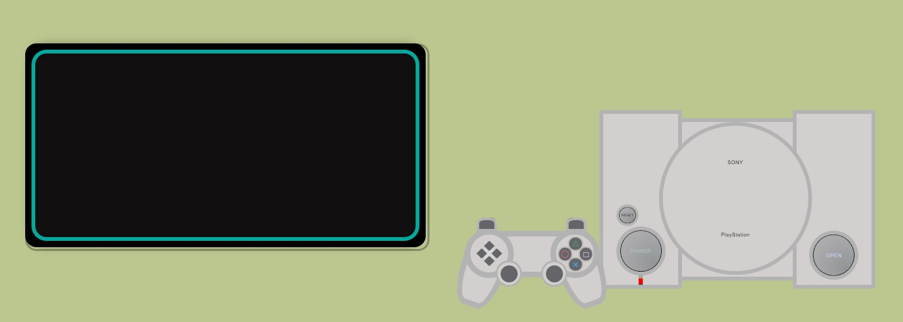

# Proyecto 2.

 ## Playstation 1.

 En este proyecto he intentado recrear una Playstation 1 con archivos HTML, CSS y JavaScript.
 Es el segundo proyecto del Bootcamp de Full Stack Developer de Geekshubs Academy.
 
 

 ### Consta de una PS1 con su mando y una pantalla.
 Al proyecto he querido poner ademas de una Playstation 1 una pantalla donde poder ver los resultados de interactuar con algunos botones con los que en algunos casos tendrán función y en otros no.

 ### La consola.
 La consola contiene un botón de encendido llamado "Power" con el que conseguiremos hacer que se encienda la pantalla, se mostrará una imagen de inicio de "Playstation" y el led pasará de color rojo a color amarillo, esto indicará que la Playstation está encendida, por lo cual, los botones del mando que son operativos funcionarán.
 Con el mismo botón la consola se apagará y el led volverá a ser de color rojo, por lo que los botones del mando quedarán inutilizados.
 A pesar de tener dos botones mas, los demás botones de la consola no tienen ninguna utilidad ni efecto.

 ### El mando.
 El mando de la Playstation tiene los tipicos botones de flecha, los cuales no estan operativos, pasa lo mismo con los gatillos y los joysticks, sin embargo los botones circulares de la derecha si lo están, con ellos puedes interactuar con la pantalla haciendo que en ella se muestren diferentes videos de juegos, cada uno diferente con cada boton y solo funcionan cuando la pantalla está encendida.

 ### La pantalla.
 La pantalla es en el lugar donde va a poder verse la interacción de los botones, está formada con un diseño rectangular con los bordes redondeados, un borde interior y otro exterior para darle un toque estético y no se viera demasiado simple.

 ## Tecnologias utilizadas.
 

### Posibles mejoras.
Me habria gustado poder añadir mas funcionalidades a los distintos botones que se han quedado sin ninguna función.
